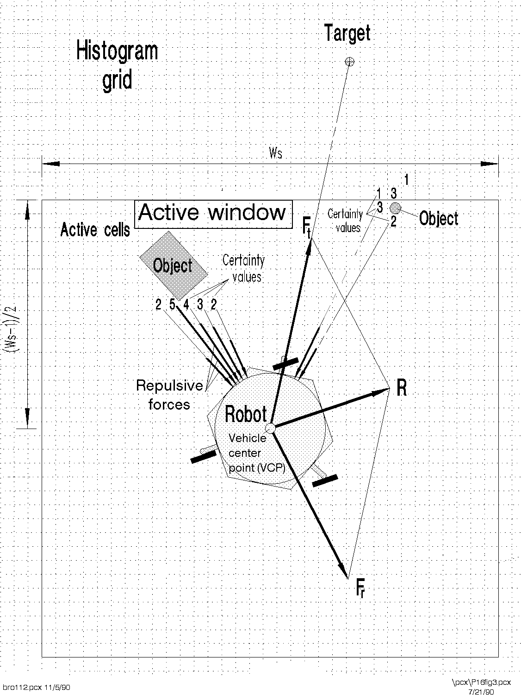
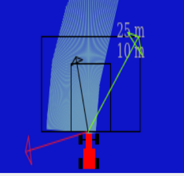

# Obstacle Avoidance

The objective of this practice is to implement the logic of the VFF navigation algorithm. Navigation using VFF (Virtual Force Field), consists of:

* Each object in the environment generates a repulsive force towards the robot.

* Destiny generates an attractive force in the robot.

This makes it possible for the robot to go towards the target, distancing itself of the obstacles, so that their address is the vector sum of all the forces.

## Virtual Force Field Algorithm (VFF)

The Virtual Force Field Algorithm is a navigation technique for local navigation wich consists in generate three different vectors or forces that are the next ones:

* **Attractive Forces:** The attractive forces draw the robot towards a specific goal or target location. They are like the positive charges in our electromagnetic analogy, pulling the robot closer to its objective.

* **Repulsive Forces:** On the flip side, repulsive forces act as a shield to prevent the robot from colliding with obstacles in its path. These forces emanate from objects or obstacles, effectively repelling the robot as if they were negatively charged particles.

* **The Combining Forces:** The VFF algorithm computes the net force acting on the robot by summing up the attractive and repulsive forces. The resulting force vector indicates the direction in which the robot should move.



## Implement

The first thing we need to achieve the objective of achieving reactive behavior that avoids obstacles is to find the vectors of the aforementioned algorithm.

To obtain them I first need the coordinates of both the car and the waypoints. And for calculations I need a reference point.

We can calculate the reference point by taking the absolute coordinates, which of the two coordinate systems we have, are centered on the circuit itself, with (0,0) being the place where the car begins its movement. And also I need the coordinates of the car. These will be the **absolute coordinates**.
The sistem atached to the car will be the relative coordinates. To get the *absolutes* I use the GUI of the practice.

```python
target_abs_x = currentTarget.getPose().x
target_abs_y = currentTarget.getPose().y

absolute_taget = target_abs_x, target_abs_y

```

For the relatives ones I use the code given in the documentation of the practice. This code has the calculations needed for this pourpouse.

```python
def absolute2relative (x_abs, y_abs, robotx, roboty, robott):

    # robotx, roboty are the absolute coordinates of the robot
    # robott is its absolute orientation
    # Convert to relatives
    dx = x_abs - robotx
    dy = y_abs - roboty

    # Rotate with current angle
    x_rel = dx * math.cos (-robott) - dy * math.sin (-robott)
    y_rel = dx * math.sin (-robott) - dy * math.cos (-robott)

    return x_rel, y_rel
```

Now I can get the relative coordinates of the waypoint and from this I can calculate the first of the vectors wich points the direction that must follow the car.

The next vector I need to calculate is the one that representes the repulsive force from the obstacles. For this task I need to use the data given by the laser using one more tiem the code given in the documentation. Using that data I make the calculations.

```python
def parse_laser_data(laser_data):
    laser = []
    i = 0
  
    for i, dist in enumerate(laser_data.values):
        if dist > 10:
            dist = 10
        angle = math.radians(i-90) # because the front of the robot is -90 degrees
        laser += [(dist, angle)]
        i+=1
    return laser

def get_repulsive_force(parse_laser):
    laser = parse_laser
    
    laser_vectorized = []
    for dist, angle in laser:
      
        x = 1/dist * math.cos(angle) * -1
        y = 1/dist * math.sin(angle) * -1

        v = (x,y)
        laser_vectorized += [v]
    laser_mean = np.mean(laser_vectorized, axis=0)
    return laser_mean
```

Once I have the repulsive force vector and the direction vector, to calculate the resulting force I just have to add them. As a result we obtain the force vector with which I will regulate the speeds of the car.

```python
    # Car direction  (green line in the image below)
    carForce = [max(min(target_rel_x, 3.5), -3.5), max(min(target_rel_y, 3.2), -3.2)]
    # Obstacles direction (red line in the image below)
    obsForce = [get_repulsive_force(laser)[0], get_repulsive_force(laser)[1]]
    # Average direction (black line in the image below)
    avgForce = [(carForce[0]+obsForce[0]), (carForce[1] + obsForce[1])]
```

> The carForce vector is limited to prevent the resulting force from being too large

* Image of the vectors in a run of the code:



## First tests

Once I have all the vectors I can start to test if the car can avoid collisions and reach all the waypoints. For the moment I use the forces as they are calculated with the data I obtain from the laser without adjusting any of the forces.

To calculate the angular and linear velocities I use this calculations:

```python
tan = math.tan(avgForce[1]/avgForce[0])
HAL.setW(tan)
HAL.setV(abs(avgForce[0]))
```

> I use the *abs* function in the linear speed to avoid the car to go backwards


> Sometimes the car made the entire circuit from outside.

As it can been seen the car do not avoid the way as is expected and when is too close to a wall it go through it to then start glitching.

To improve the avoidance I will use two variable in the *obsForce*, one in the *X* coordinate and one in the *Y* coordinate. Also I will add a variable to the *Y* coordinate of the resulting force to increase the linear velocity.

After several tests I can draw several conclusions:

* If we multiply the *x* coordinate by a number that is too large we will end up obtaining a minimum

* The only thing we get if the *Y* variable is very large is sudden movements and the car drives further away from the walls. For this reason a lower value is preferable to have a more progressive movement.

* The increase in *X* reduces the speed of the car, so it is necessary to slightly increase the speed of the car by multiplying the **avForce[0]** by a variable.

## Problems and Solutions

The most recurring error I have encountered occurred when an obstacle appeared right in front of the car when it was moving in a straight line. On most occasions, after several adjustments, this obstacle was always hit either slightly or completely squarely. Sometimes this obstacle would get stuck to the car, causing it to fail the rest of the circuit, either creating oscillation or causing it to go through walls.

Another obstacle with I had a lot of problems was the one wich is near a wall and the car run between it and the wall. The results were the same as the previous problem.

I have continued to have these problems until a classmate told me that I have been doing wrong the maths for the anfular speed: I was using the tangent and the correct way is the arctangent.

```python
# Wrong calculations
tan = math.tan(avgForce[1]/avgForce[0])

# Good calculations
arctan = math.atan(avgForce[1]/avgForce[0])
```

> Note that the only difference is one 'a'. From ***TAN*** to ***ATAN***

Now the results are more satisfactory because the errors mentioned above have disappeared. I only had to adjust the forces and the car goes smooth and without crashes.

In the next video it can be seen that th car reaches the waypoints and is able to avoid all the obstacles with the only exception that somtimes this avoidance is made too close to it.


