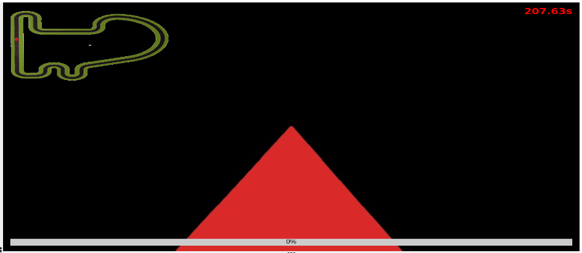
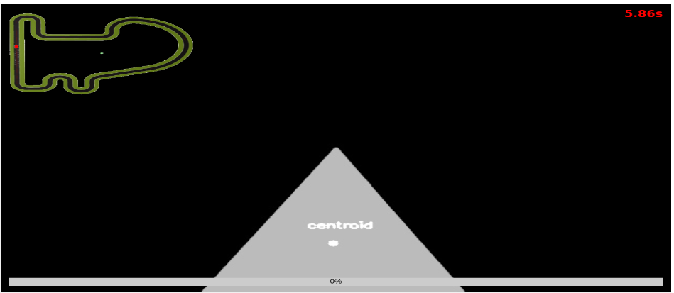
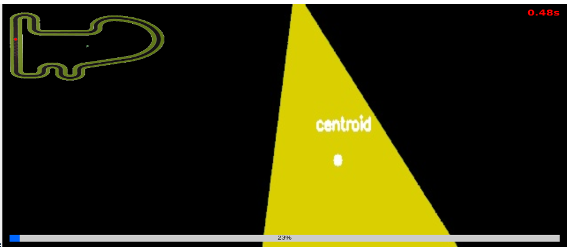
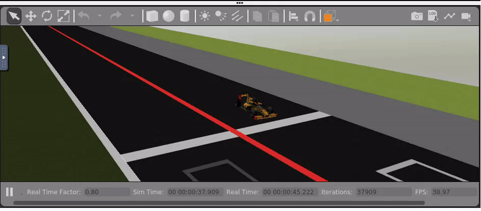
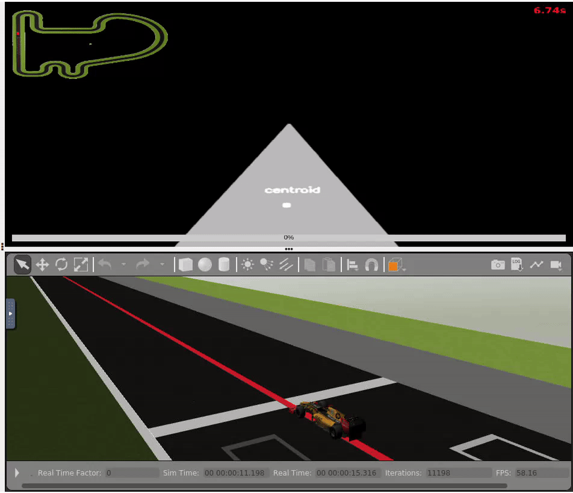

# Follow Line

For this second practice for mobile robotics, I need to implement the code for a line follower, which must adjust its speed automatically through the use of **PID** controllers and I will use image filters to isolate the line and be able to follow it effectively.

For the image code I have to use the [OpenCV library](http://opencv.org)

## Before starting

Before starting to program I must set some objectives so that little by little the program develops.

1. Get the line.
2. Find the centroid.
3. *PID* for angular velocity.
4. *PID* for linear velocity.
5. (Possible improvement) Split the image in two: whit two centroids calculate linear and angular errors.
 
## *PID*

A **PID** controller (proportional, integral and derivative controller) is a control mechanism that, through a feedback loop, allows the regulation of speed, temperature, pressure and flow among other variables of a process in general. The **PID** controller calculates the difference between our actual variable versus the desired variable.

To adjust the speed of the 'car' I have to use this controllers, wich will make it automatically. The best way to get a useful **PID** is to start bit by bit. That is to start whit a *P* controller, then a *D* controller and if needed, a *I* controller.

## OpenCV


OpenCV is an open source library that is designed to work with images. This package includes different features like fillters and options to customize the image.

Since the line to follow is red, I must create a filter that only detects that color. This is the code that filters the image to only show that color:

```python
image = HAL.getImage()
    
    boundaries = [
	([17, 15, 100], [50, 56, 255])]

    for (lower, upper) in boundaries:
      	# create NumPy arrays from the boundaries
      	lower = np.array(lower, dtype = "uint8")
      	upper = np.array(upper, dtype = "uint8")
      	# find the colors within the specified boundaries and apply
      	# the mask
      	mask = cv2.inRange(image, lower, upper)
      	output = cv2.bitwise_and(image, image, mask = mask)
      	# show the images
      	GUI.showImage(output)
      	cv2.waitKey(0)
```



The next thing to find once we have created the mask is the ***centroid*** of the figure to be able to make the necessary calculations to follow the line.

```python
ret,thresh = cv2.threshold(gray_img,70,255,0,cv2.THRESH_BINARY)
    contour, _ = cv2.findContours(thresh, cv2.RETR_EXTERNAL, cv2.CHAIN_APPROX_SIMPLE)
    
    for c in contour:
        M = cv2.moments(c)
        print()
        if M["m00"] != 0:
           cx = int(M["m10"] / M["m00"])
           cy = int(M["m01"] / M["m00"])
        else:
           cx, cy = 0, 0
        
        cv2.circle(output, (cx, cy), 5, (255, 255, 255), -1)
        cv2.putText(output, 'centroid', (cx - 25, cy - 25), cv2.FONT_HERSHEY_SIMPLEX, 0.5, (255, 255, 255), 2)
```

A change regarding the original *centroid* code is the if-else statement, wich allows to avoid an ocassional bug.



To further improve the reactivity of the program, we can leave out the upper part of the image because nothing relevant to the execution of the program is shown. Therefore, using openCV once again we crop it before working with it.
> corte = image_hsv[250:450, 0:image_hsv.shape[1]]



To achieve this, I follow the tutorials and recomendations given to us in the documentation of the practice. Here are two links I used:

[OpenCV en español](https://omes-va.com/deteccion-de-colores/)

[OpenCV en inglés](https://stackoverflow.com/questions/10469235/opencv-apply-mask-to-a-color-image)

To improve once more the processing of the image, I change the code used in the mask to get the red line. 

## 

The first step to start once I have the processed image, is to implement the *P* controller to adjust the angular speed to maintain the car with straight movement in staight line an to take the curves without oscillation.

The calculations are simple, only I need to find the error between the **centroid** and the center of the image to then multiply it by the **Kp** parameter wich I have to adjust until I have the proper functioning.

Once I have this first controller the bugs start to appear. By now I have 3 different errors:

1. The process dies and the car starts spinning without any control.
2. The process dies and the car doesn't move at all.
3. The process does not die and the car moves exclusively in a straight line

> **Escenario 1**:



> **Escenario 2**:



> **Escenario 3**			:


To resolve these erros I modify different parts of the code. The first change was to add the if-else statement I note before in the centroid code. Another change was to add a maximum angular velocity.

The next change was to add the *D* controller to avoid oscillations and be able to use a higher linear speed. The calculation for this term is to multiply the *Kd* variable by the substration of the error and the previous error.

```python
derivative_term = Kd * ((error - prev_error))
angular_vel = Kp * error + derivative_term

[...]

prev_error = error
```

I tried to add the *I* controller but no matter the value of the *Ki* variable, the movement I get isn't the correct one. For this reason this term will be 0 until I really need it and it doesn't ruin the functioning.

This code is version 1 of the program: [follow_line_v1.py](https://github.com/iperal2021/blog/blob/master/practica_2/follow_line_v1.py)

## 

For now the speed has been quite low if I want the car to travel the entire circuit. To increase this speed I am going to add the controller for the linear speed.

The calculations are the same as for the **PID** of the angular speed, with the difference that I have the substrac the result of the proportional and the derivative terms to a maximum speed.

```python
linear_vel = max_linear_vel - (abs(error_linear) * Kp_linear + derivative_term_linear)
```

I use the python ***abs()*** function on the error to avoid speeds higher than the maximum and the possibility of get negative values.

Now I need to find the correct values for the **PID** variables that is a slow job since you have to adjust the linear and angular speed, and changing the value of one affects the other.

This code is version 1.5 of the program: [follow_line_v1_5.py](https://github.com/iperal2021/blog/blob/master/practica_2/follow_line_v1_5.py)

## Higher speed

After hours of trial and error I have decided to change my approach. Instead of adjusting linear and angular speed separately, what I will do is use one **PID** for straight lines and another for curves. I decided this after asking colleagues for whom this way gave them shorter times than mine. This way the car should can have higher speed.

To differentiate between curves and straights I use the error comparing it with a maximum value, which if exceeded will be considered a curve and therefore the *PID* used is appropriate for this part of the racing circuits.

```python
    if abs(error) > 110:

        angular_vel, linear_vel = *PID*(Kd_curva, Kp_curva, max_linear_vel_curva)

    else:

        angular_vel, linear_vel = *PID*(Kd_recta, Kp_recta, max_linear_vel_recta)
```

I have written a function that calculated both *PID*s. This function need the variables of the proportional and derivative terms and a maximum vel for the linear velocity to avoid to much speed in curves wich could generate too much error and oscillations.

This code is version 2 of the program: [follow_line_v2.py](https://github.com/iperal2021/blog/blob/master/practica_2/follow_line_v2.py)

Once again, after many attempts to adjust both *PID*s, the results are not satisfactory because oscillation is inevitable and the lap time is still higher than expected, and that is when the complete lap is managed, which rarely happens.

As a test to remedy this problem and be able to achieve better times, I have decided to take a step back and re-regulate the angular and linear speed separately without taking into account straight lines and curves. Thanks to different advances that I achieved while making the previous version this time the adjustment is more efficient.

For this version there are several points to highlight, such as the reuse of the function that calculates the *PID* or the or the use of the integrative term, but whose value remain 0, due to that the slightest variation in it's value make the controller work totally different.

* *PID* function:
  
```python
# *PID* function from the previous version
    def *PID*(KD, KP, KI, max_vel_linear):
  
        global sum_error
        derivative_term = KD * ((error - prev_error))
        sum_error += error * time_elapsed
        integral_term = KI * sum_error
        
        angular_vel = KP * error + derivative_term + integral_term
        angular_vel = max(-max_angular_vel, min(max_angular_vel, angular_vel))
        linear_vel = max_vel_linear - (abs(error) * KP + derivative_term + integral_term)
        linear_vel = max(min_linear_vel, min(max_vel_linear, linear_vel))

        return angular_vel, linear_vel

# Setting the speeds 
angular_vel, _ = *PID*(Kd_a, Kp_a, Ki_a, 0)
_, linear_vel = *PID*(Kd_l, Kp_l, Ki_l, max_linear_vel)
```

Another important change made is in the cropping of the image, which has been increased in the lower part, in this way we only process the upper part of the line that must be followed, making the program more reactive.

* One of the best results I could achieve:


This code is version 2.5 of the program: [follow_line_v2_5.py](https://github.com/iperal2021/blog/blob/master/practica_2/follow_line_v2_5.py)

## Final version and conclusion

The final version discards the idea of ​​separating the image in two and working with two centroids. Maybe doing it that way could make the *PID* more precise but the actual code whit enough time can be dajusted to be fast and precise. 

An aspect that I have not addressed either is that the camera is not in the center of the car. This can be fixed with a simple calculation, but for some reason it makes the *PID* adjustment more imprecise.Which brings us to a very important conclusion about the *PID* that must be taken into account:

* ####  Once the *PID* is adjusted to achieve the highest possible precision and speed, no matter how well it works, once the execution is paused and the program is resumed or re-launched, the result will vary.

After many tests in different circuits with the most general PID I have reached this conclusion. Although I do not know the exact reason why this happens, I assume that it is due to several factors beyond my control, such as the speed of the internet connection or the traffic of the website itself.
