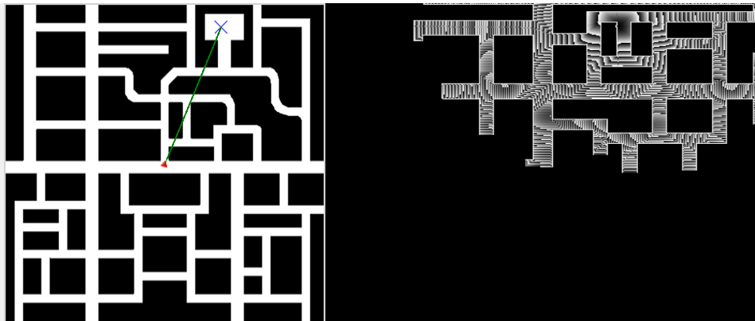
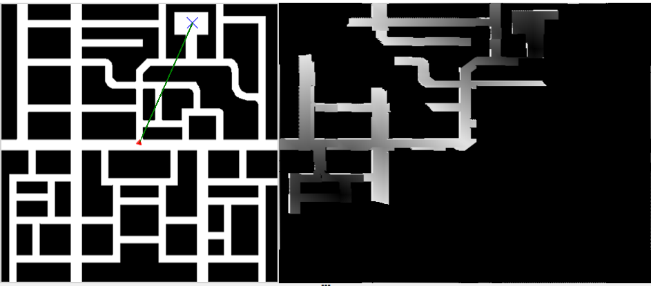
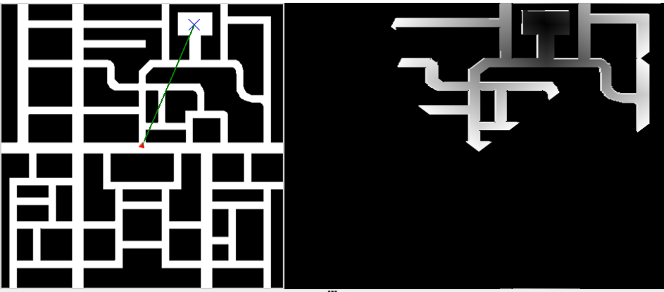
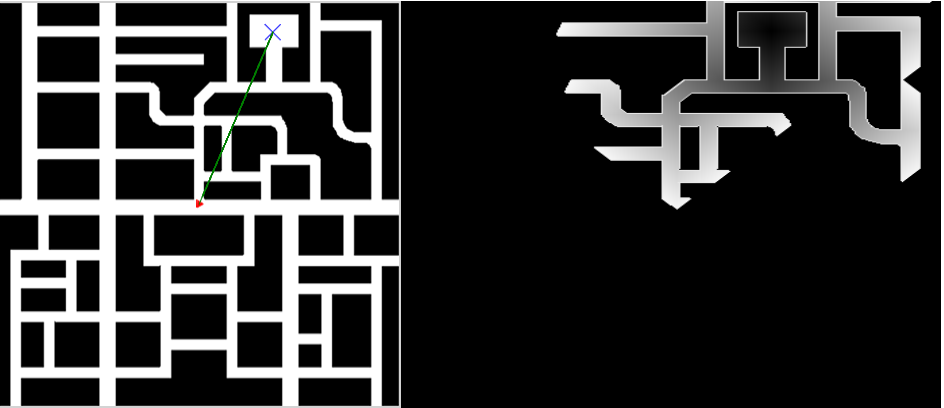

# Global Navigation

For this exercise I hava to implement a autonomous navigation using a ***Gradient Path Planning System*** (GPP) algorithm. Global navigation through GPP, consists of:

Selected a destination, the GPP algorithm is responsible for finding the shortest path to it, avoiding, in the case of this practice, everything that is not road. Once the path has been selected, the logic necessary to follow this path and reach the objective must be implemented in the robot. With this, it is possible for the robot to go to the marked destination autonomously and following the shortest path.

In robotics, the word "motion planning" refers to the process of identifying a series of workable configurations that move a robot from one location to another. Motion planning algorithms are used in a wide range of contexts, including the study of biological molecules, industrial manipulators, mobile robots, artificial intelligence, and animations.

There are primarily two ways to do the task: Sampling-Based Path Planning and Gradient Path Planning

Gradient Path Planning
Gradient Path Planning is one such motion planning technique. Potential fields are the foundation of GPP's operation. The target serves as a potential well and the path's obstructions as a potential wall for the path planner. All possible walls and wells are combined to create a road that slopes downward. The robot proceeds along that route.

## Different versions

The global navigation practice has been the thoughtest of all by the momment. Some of the reasons are the coincidence of a lot of other assignments and the one that delay me the most: my own coding errors. I was at a standstill in the grid, and because of it I couldn't progress in the movement of the car.

At first I write the grid algorithm inside the main loop, wich made the process so low that for targets near the initial point it take more than ten minutes to complete a grid that wasn't even loks like how it should.

Then I relice how to solve the problem: I change the code to a function that executes the grid algorithm, and now ir only takes few seconds. 

At one point I added an heuristic function, this becouse Is the way we realize this type of exercise (to expand nodes or in this case coordinates) in the subject of Artificial intelligence when we use the A* search algorithm.

Some versions of the algorithm:

* First version

```python
if not target_found:
            next_point = points.get()
            print(next_point)
            print("carPose: ", carPose)
            if (next_point == carPose):
                print("FIN")
                target_found = True
            priority, coords = next_point
            x,y = coords
            grid[y, x] = priority
            print("X: ", x_cord, " Y: ", y_cord)
            print("Expanded: ",expanded)
            if x_cord >=  0 and x_cord <= 400 and next_point not in expanded:
                print("Primer sub-if")
                if y_cord >=  0 and y_cord <= 400: 
                    
                    print("vecinos")
                    expanded.append(next_point)
                    if (map_array[x][y+1] != 0):
                        print("1 ", map_array[x][y+1])
                        grid[y+1][x] = priority+1
                        points.put((priority+1, [x, y+1]))
                    elif ( map_array[x-1][y] == 0):
                          grid[y+1][x] = priority+10      
                        
                    if (map_array[x][y-1] != 0):
                        print("2", map_array[x][y-1])
                        grid[y-1][x] = priority+1
                        points.put((priority+1, [x, y-1]))
                    elif ( map_array[x-1][y] == 0):
                          grid[y-1][x] = priority+10    
                        
                    if (map_array[x+1][y] != 0):
                        print("3", map_array[x+1][y])
                        grid[y][x+1] = priority+1
                        points.put((priority+1, [x+1, y]))
                    elif ( map_array[x+1][y] == 0):
                          grid[y][x+1] = priority+10    
                        
                    if (map_array[x-1][y] != 0):
                        print("4", map_array[x-1][y])
                        grid[y][x-1] = priority+1
                        points.put((priority+1, [x-1, y]))
                    elif ( map_array[x-1][y] == 0):
                          grid[y][x-1] = priority+1000
                    
                    for j in range(-1, 1):
                        for k in range(-1, 1):
                            if (map_array[x+j][y+k] != 0):
                                grid[y+j][x+k] = priority+1.4
                                points.put((priority+1.4, [x+j, y+k]))
                            elif ( map_array[y+k][x+j] == 0):
                                grid[y+j][x+k] = priority+1000
               
    GUI.showNumpy(grid)
```

* Third version:

```python
if coords not in expanded:
            expanded.append(coords)
            print("X: ", coords[0], "Y: ", coords[1])
            directions = [(0, 1), (0, -1), (1, 0), (-1, 0)]
            for dx, dy in directions:
                nx, ny = x + dx, y + dy
                if 0 <= nx < len(map_array) and 0 <= ny < len(map_array[0]):
                    if map_array[nx][ny] != 0:
                        grid[ny][nx] = priority + 1
                        print(grid)
                        points.put((priority + 1, [nx, ny]))
                    elif map_array[nx][ny] == 0:
                        grid[ny][nx] = priority + 10
                        
            for j in range(-1, 1):
                for k in range(-1, 1):
                    if 0 <= x+j < len(map_array) and 0 <= y+k < len(map_array[0]):
                        if map_array[x+j][y+k] != 0:
                            grid[y+j][x+k] = priority+1.4
                            print(grid)
                            points.put((priority+1.4, [x+j, y+k]))
                        elif map_array[x+j][y+k] == 0:
                            grid[y+j][x+k] = priority+10
                            
    
    GUI.showNumpy(normaliced(grid))
```

* Fourth version:

```python
if not target_found:
        next_point = points.get()
        priority, coords = next_point
        x, y = coords

        if coords == carPose:
            print(counter)
            print("FIN")
            target_found = True

        if (x,y) not in expanded:
            counter += 1
            expanded.add((x, y))
            print("X: ", coords[0], "Y: ", coords[1])
            directions = [(0, 1), (0, -1), (1, 0), (-1, 0)]
            for dx, dy in directions:
                nx, ny = x + dx, y + dy
                if 0 <= nx < len(map_array) and 0 <= ny < len(map_array[0]):
                    if map_array[nx][ny] != 0 and (nx, ny) not in expanded:
                        heuristic = distance_heuristic((nx, ny), targetPose)
                        cost = heuristic + priority + 1
                        grid[ny][nx] = cost
                        points.put((cost, [nx, ny]))
                    elif map_array[nx][ny] == 0 and (nx, ny) not in expanded:
                        grid[ny][nx] = priority + 1000

            for j in range(-1, 1):
                for k in range(-1, 1):
                    if 0 <= x+j < len(map_array) and 0 <= y+k < len(map_array[0]):
                        if map_array[x+j][y+k] != 0 and (x+j, y+k) not in expanded:
                            heuristic = distance_heuristic((x+j, y+k), targetPose)
                            cost = heuristic + priority + 1.4
                            grid[y+j][x+k] = cost

                            points.put((cost, [x+j, y+k]))
                        elif map_array[x+j][y+k] == 0 and (x+j, y+k) not in expanded:
                            grid[y+j][x+k] = priority + 1000
```

* Final version:

```python
if (x, y) not in expanded:
    counter += 1
    expanded.add((x, y)) # added to visited coords list
    print("X: ", x, "Y: ", y)
    
    # coordinates up, down, left and right
    directions = [(0, 1), (0, -1), (1, 0), (-1, 0)]
    
    # weights or priorities
    cost_cross = priority + 1
    cost_x = priority + 1.4
    
    # added to the grid and the points queue the horizontal and vertical coords
    for dx, dy in directions:
        nx, ny = x + dx, y + dy
        if 0 <= nx < 400 and 0 <= ny < 400:
            if map_array[ny][nx] != 0 and (nx, ny) not in expanded:
                grid[ny][nx] = cost_cross
                points.put((cost_cross, [nx, ny]))
            elif map_array[ny][nx] == 0 and (nx, ny) not in expanded:
                grid[ny][nx] = 1000
    
    # added the diagonal coordinates
    for j in range(-1, 1):
        for k in range(-1, 1):
            if 0 <= x + j < 400 and 0 <= y + k < 400:
                if map_array[y + k][x + j] != 0 and (x + j, y + k) not in expanded:
                    grid[y + k][x + j] = cost_x
                    points.put((cost_x, [x + j, y + k]))
                elif map_array[y + k][x + j] == 0 and (x + j, y + k) not in expanded:
                    grid[y + k][x + j] = 1000
```

At first I write the grid algorithm inside the main loop, wich made the process so low that for targets near the initial point it take more than ten minutes to complete a grid that wasn't even loks like how it should.

Then I relice how to solve the problem: I change the code to a function that executes the grid algorithm, and now ir only takes few seconds. 

At one point I added an heuristic function, this becouse Is the way we realize this type of exercise (to expand nodes or in this case coordinates) in the subject of Artificial intelligence when we use the A* search algorithm.

The differents grids that I get along the versions:









## Actual navigation

Once I succeeded making the gradient I was able to start the navigation. For it I use the obstacle avoidance practice as a template. From that exercise I use the methods absolute2relative and getForces, editing this last one to fit in what I need for the navigation. I only use the atractive force vector, which in a start I created from the car coordinates to the target coordinates, but it not only go through the walls, but also the car run in circles around the map.
