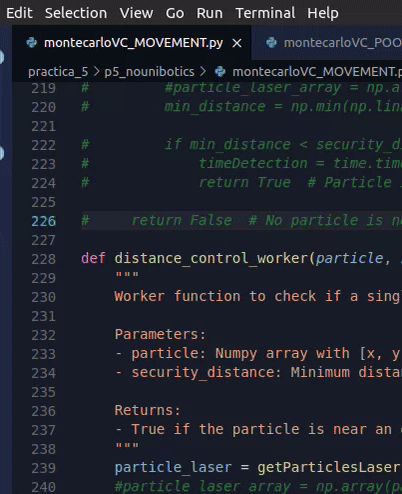

# Monte Carlo Laser Localization

## Description

Probabilistic localization in robots involves:

A. Probabilistic Motion Model: Describes robot movement using a probability function due to noise sources, making accurate predictions challenging.

B. Probabilistic Model of Sensory Observation: Built from sensor measurements, calculating the probability of the robot being in known positions.

C. Probability Fusion: Involves accumulating information over time using Bayes' theorem to concentrate probability in one mode, indicating the robot's position.

Monte Carlo Localization:

Based on particles or samples representing the a posteriori probability function, estimating likely robot positions. Particles correct and decrease accumulated error through robot movements, converging to a single zone over iterations.

Algorithm:

1. Initialize evenly distributed samples with equal weights.

2. Repeat for each sample:

    <ol style="list-style-type: lower-alpha">
    <li>Move the robot, read sensor.</li>
    <li>Update particle location.</li>
    <li>Assign importance weights based on sensor probability and update location.</li>
    </ol>

3. Create a new set of samples by sampling with replacement from the current set based on importance weights. Repeat as needed.

## First steps

We started with some exaplex of how the GUI, HAL and MAP classes work to then can implement the real algorithm.

This examples are the following:

* propagate_particles_example.py:
* resample_example.py:
* robot_movement_example.py:
* show_laser_example.py:
* show_particles_example.py:

Thank to this examples I could how each part of the practices works. Usinf the different functions I could recreate the basic movement of the robot and the particles at the same time.

## Creating particles

For this type of localization, the first to implement is the creation of particles to later work with them. Using the examples mentioned above I was able to create the particles and give them movement. Among the modifications made to the functions given by the teacher, one of great importance is the one that prevents the creation of particles outside the limits of the white areas of the map.

* Beforce
  


* After
  


```python
particle = []
for i in range(N_PARTICLES):
    particles = np.random.uniform(low=[x_low, y_low, 0.0],
                                high=[x_high, y_high, 2*np.pi],
                                size=(3,))
    particle_map = MAP.worldToMap(particles[0], particles[1])
    
    while map[particle_map[1], particle_map[0]] == 0:
        particles = np.random.uniform(low=[x_low, y_low, 0.0],
                                high=[x_high, y_high, 2*np.pi],
                                size=(3,))
        particle_map = MAP.worldToMap(particles[0], particles[1])
    particle.append(particles)
```

Once the particles are created and mimics the robot movement is time to generate laser lectures for each particle. For this task I seen easier to copy the alredy laser function used for the robot laser and edit it to be used with the particles. I needed to edit two functions:

1. *getLaserData()*
2. *virtual_laser_beam()*

The changes in the first are the most significant.

```python
[...]

for particle in particles:
    # Get the robot pose in map coordinates as the origin of the laser 
    start_x, start_y, particle_yaw_map = MAP.worldToMap(particle[0], particle[1], particle[2])
    # Convert max laser detection distance from meters to map cells
    laser_distance_cells = MAX_LASER_DISTANCE * MAP.MAP_SCALE
    virtual_laser_xy = []
    laser_count = 1

    for beam_angle in range(180):
        if laser_count == LASER_SKIP_RATIO:
            # Actual beam's angle in map coordinates
            # Subtract 90º to have the center aligned with the robot
            angle = particle_yaw_map + np.radians(beam_angle) - np.pi/2
            # Compute the theoretical (max) endpoint of the laser
            end_x = start_x + laser_distance_cells * np.cos(angle)
            end_y = start_y + laser_distance_cells * np.sin(angle)
            # Get the laser measurement
            laser_x, laser_y = particle_virtual_laser_beam(start_x, start_y, end_x, end_y)
            virtual_laser_xy.append((laser_x, laser_y, 0))
            laser_count = 1
        else:
            laser_count += 1
[...]
```

For the virtual laser function the only change is this:

```python
if 0 <= x < 400 and 0<= y < 400:
    if map[y, x] == OBSTACLE_VALUE:
        return (x, y)
```

Adding the first if sentence avoid to generate the laser if the particle is out of the map limits.

## Assign weights

Assign weights is the most important part of the algorithm. The weights determines if the particles' position is the most similar to the actual position of the robot. For this task I had to compare the real laser of the robot and the virtual laser created for each particle and assign a weight to it depending on the similarity with it.

These calculations are very demanding at the program level, and that is why the program goes slow or even stops, because Python only uses one of the machine's **CPU**.

To reduce these limitations I wanted to use all the *numpy* functions that I could, trying to accelerate the calculations all I could. While searching and investigating through *numpy* documentation and different blogs and post I found the `np.linalg.norm` function which helps me in this task.

The `np.linalg.norm` function works to calculate the norm (length) of a vector or the norm of a matrix. The norm is a measure of the magnitude of a vector or matrix in a vector space.

The basic syntax of `np.linalg.norm` is as follows:

```python
numpy.linalg.norm(x, ord=None, axis=None, keepdims=False)
```

* `x`: The vector or matrix for which you want to calculate the norm.
* `ord`: Optional parameter that specifies the type of norm to calculate. It can take various values, such as `None` (default), 1, 2, inf, etc.
* `axis`: Optional parameter that specifies the axis along which the norm should be calculated in the case of multidimensional arrays.
* `keepdims`: Optional parameter that, if set to True, keeps the dimensions reduced instead of removing them.

```python
def compute_particle_weights(particles_laser, real_laser):
    weights = []

    for particle_laser in particles_laser:
        # Convert the list of laser readings from the particle into a numpy array
        particle_laser_array = np.array(particle_laser)

        # Calculate the similarity (inverse of the difference) between the reference and the particle
        similarity = np.linalg.norm(real_laser - particle_laser_array)

        # Normalize the similarity to obtain the weights
        weights.append(1 / (1 + similarity))

    return np.array(weights)
```


For now I only use a minimum of 100 to 300 particles with 18 beams per laser to not get a slow execution, but it makes the program less exact and deppending on the execution, it sometimes takes too long to locate the robot.

## Multiprocessing

Due to the problem exposed before I decided to try to use the *multiprocessing* library as it recommended the teacher. The class used from this library was the ***Pool*** class, more specifically the function *starmap*.

I used this tool to accelerate the execution of one of the principal functions *compute_particle_weights()*.

```python
def compute_particle_weights(particles, real_laser):
    weights = []

    with Pool(N_CPU) as pool:
        # Use extend instead of append to avoid creating nested lists
        weights = pool.starmap(weights_func, zip(particles, repeat(real_laser)))
    
    return np.array(weights)

def weights_func(particle, real_laser):
    weights = []
    particle_laser = getParticlesLaser(particle)
    # Convertir la lista de lecturas láser de la partícula en un array numpy
    particle_laser_array = np.array(particle_laser)

    # Calcular la similitud (inversa de la diferencia) entre la referencia y la partícula
    similarity = np.linalg.norm(real_laser - particle_laser_array)

    # Normalizar la similitud para obtener los pesos
    weights.append(1 / (1 + similarity))
    #print("Pesos", weights, "\n")
    return np.array(weights)
```

This way I use all the CPU from my machine, accelerating the execution of the program, obtaining a faster program capable of working with a greater number of particles.

With the addition of this function to add multiprocessing this is the execution using 400 particles and 20 beams per particle.


> The speed and efficiency of the localization depends on the execution, sometimes is better, sometimes is worse.

## Vacuum cleaner like movement

For last step I tried to implement the movement from the first practice to this one.

By adding the state machine used in the autonomous vacuum cleaner I have achieved a movement similar to the desired one. However, at first the particles only maintained one possible direction of rotation, that is, if the robot rotated, the particles performed the same movement but always to the left side (counterclockwise). This bug was fixed in at some point in the various tests and code edits.

To get the movement I used the code from the First Practice wich can be consult in this blog. The laser detectión function I used is the follow:

```Python
def distance_control_worker(particle, security_distance):
    """
    Worker function to check if a single particle is near an obstacle based on laser data.

    Parameters:
    - particle: Numpy array with [x, y, yaw] values.
    - security_distance: Minimum distance to consider safe from obstacles.

    Returns:
    - True if the particle is near an obstacle, False otherwise.
    """
    particle_laser = getParticlesLaser(particle)
    min_distance = np.min(np.linalg.norm(particle_laser[:, :2], axis=1))

    return min_distance < security_distance
```

For this function I also used the *Pool* function to get more execution speed.



> Used 200 particles, 20 beams. The program also work with 500

As seen below, unfortunately the obstacle detection is not reliable and almost every execution finish in error when the robot goes off the map limits. The first *30* seconds are for have enough time to the localization.
