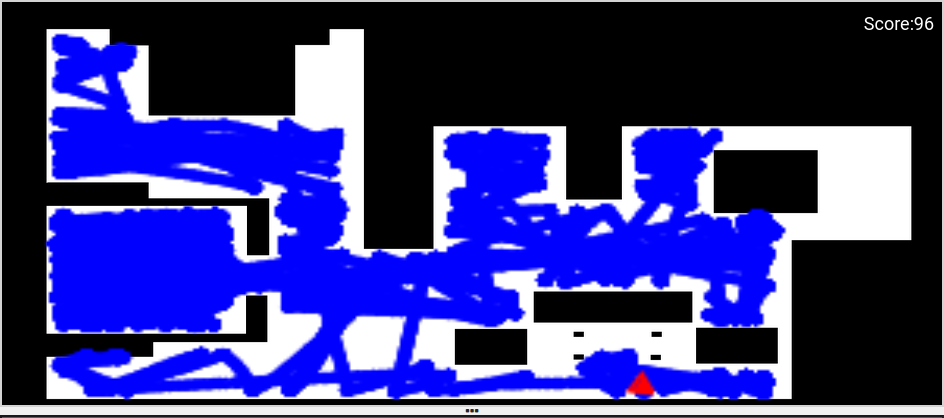
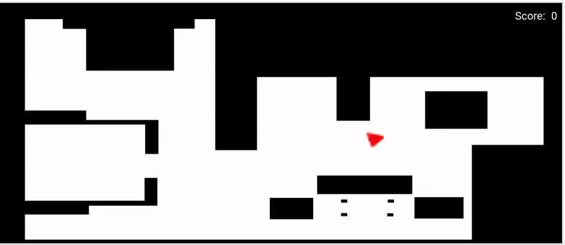

Basic Vacuum Cleaner

# Basic Vacuum Cleaner

For the first practice, I have to program the behavior of a basic vacuum cleaner.

Program Requirements:

* State machine
* Random movement
* Spiral movement
* Use of the laser

The first step before starting the program, following the requested requirements, is to think about how I want it to behave. In other words, what states it will have, what algorithm random movement will follow, and how I will read distances to avoid obstacles on the map.

## First step in implementation

The conclusions I draw are as follows:

1. State Machine

   The state machine I want to implement has a total of three states: spiral movement, forward movement, and the turn that I plan to make random.

2. Spiral Movement

   To perform a spiral movement, I need to calculate the linear and angular velocities and the turning time mathematically. This way, I will achieve the desired movement. The idea is that this is the first state of the program and a possible recurrent state.

3. Obstacle Detection

   It is important to detect obstacles throughout the program to avoid any kind of collision regardless of the state we are in. To achieve this, I start with the code provided in the practice documentation:

   ```python
   laser_data = HAL.getLaserData()

   def parse_laser_data(laser_data):
       laser = []
       for i in range(180):
           dist = laser_data.values[i]
           angle = math.radians(i)
           laser += [(dist, angle)]
       return laser
   ```

4. Random Turn

   This is an important part of the program because by creating an algorithm that randomly chooses the direction of the turn and its duration, I can achieve semi-random behavior, which is what has been requested in the practice.

   A first idea for this algorithm is to randomly choose a number from a list, and based on the value of this number, turn to one side or the other and set the turn duration.

## Implementation Start

### Spiral
------

I put aside working with the laser while I try to create the spiral movement. To achieve this movement, I must make the necessary calculations for the linear and angular velocities to be optimal.

Knowing that ***v = w \* r***, where v is the linear velocity, w is the angular velocity, and r is the radius, to get the spiral, I need to increase the radius after each turn and reduce the angular velocity. The first calculation I try is as follows:

```python
INITIAL_RADIUS = 0.10
RADIUS_INCREMENT = 0.20
spiral_linear_vel = 1.00
spiral_angular_vel = spiral_linear_vel / INITIAL_RADIUS
```

With this operation, as the radius increases, the angular velocity will decrease, creating a wider movement with each turn.

Inside the while loop, I have the following code:

```python
HAL.setV(spiral_linear_vel)
HAL.setW(spiral_angular_vel)
INITIAL_RADIUS += RADIUS_INCREMENT
spiral_angular_vel = spiral_linear_vel / INITIAL_RADIUS
```

Unfortunately, these lines of code do not give the expected result when simulating, as the movement becomes linear shortly after starting the program.


After this problem, I concluded that I needed to add a *Timer* that would allow me to make multiple turns.

```python
time_per_turn = 2 * math.pi * INITIAL_RADIUS / spiral_linear_vel
time.sleep(time_per_turn)
``` 
The result obtained now is more satisfactory.


After reading the practice documentation, I realized that it was more effective to increase the linear velocity rather than the angular velocity. After testing, I concluded that indeed the speed seems more constant, but the spiral movement is not as consistent.


Investigating a way to count time without using a sleep function that could interrupt program execution, I found that with the ***time.time()*** function, I can create a function to which I can add a condition that stops the waiting loop.

```python
def my_sleep(seconds, condition):
    initial_time = time.time()
    while True:
        current_time = time.time()
        elapsed_time = current_time - initial_time
        if elapsed_time >= seconds:
            break 
        elif elapsed_time < seconds and condition:
            break
```
---
#### Laser

Once I have achieved the spiral movement, I need to start working with the laser to detect obstacles and stop the robot's movement to initiate the next state.

To obtain the distance read by the laser, I use the code given in the practice documentation, as I mentioned earlier. This code stores in a tuple all the distances detected by the laser in a range of 180 degrees.

As the base range is very large for the movement I want to achieve, I edited the code to reduce the detection range and have a more uniform movement, as I want to detect obstacles in front of the robot.

> Unedited Function

```python
def parse_laser_data(laser_data):
    laser = []
    for i in range(180):
        dist = laser_data.values[i]
        angle = math.radians(i)
        laser += [(dist, angle)]
    return laser
```

> Edited Function

```python
def parse_laser_data(laser_data):
    laser = []
    center = 90  # Central angle of the laser (180 degrees divided by 2)
    range = 45   # Range of ±45 degrees or the angle you want, in case of 
                 # choosing a different distance range, I must check if I need more calculations 
    for i in range(center - range, center + range + 1):
        if 0 <= i < 180:  # Make sure the index is in the valid range
            dist = laser_data.values[i]
            angle = math.radians(i)
            laser += [(dist, angle)]
    return laser
```
---
#### Random Turn

For the random turn, I thought of implementing an algorithm that randomly chooses the direction and duration of the turn. This implementation has gone through two different versions, with the second one being more visually clear.

The algorithm is as follows: I choose an integer from 0 to 9. In the first version, numbers from 0 to 4 would make the robot turn one way, and from 5 to 9 the other way. In the second version, I opted for odd numbers to mean a left turn and even numbers to mean a right turn.

Once the direction of the turn is chosen, I have to select the duration. To avoid the need to choose another random number, I decided to assign the times to pairs of numbers. For example, if it's 0 or 9, it's 5 seconds; if it's 1 or 8, it's 4 seconds, and so on.

> Version 1.0
```python
def random_turn():
    number = random.randint(0, 9)
    if number >= 0 and number <= 4:
        HAL.setW(ANGULAR_VEL_R)
        if number == 0:
            my_sleep_NO_condition(TURN_TIME_0_9)
        elif

 number == 1:
            my_sleep_NO_condition(TURN_TIME_1_8)
        elif number == 2:
            my_sleep_NO_condition(TURN_TIME_2_7)
        elif number == 3:
            my_sleep_NO_condition(TURN_TIME_3_6)
        elif number == 4:
            my_sleep_NO_condition(TURN_TIME_4_5)
            
    elif number >= 5 and number <= 9:
        HAL.setW(ANGULAR_VEL_L)
        if number == 5:
            my_sleep_NO_condition(TURN_TIME_4_5)
        elif number == 6:
            my_sleep_NO_condition(TURN_TIME_3_6)
        elif number == 7:
            my_sleep_NO_condition(TURN_TIME_2_7)
        elif number == 8:
            my_sleep_NO_condition(TURN_TIME_1_8)
        elif number == 9:
            my_sleep_NO_condition(TURN_TIME_0_9)
```

> Version 2.0
```python
    number = random.randint(0, 9)
    if number % 2 == 0:
        setW(0.2)  # Right turn
    else:
        setW(-0.2)  # Left turn

    if number == 0 or number == 9:
        time_to_turn = 5
    elif number == 1 or number == 8:
        time_to_turn = 4
    elif number == 2 or number == 7:
        time_to_turn = 3
    elif number == 3 or number == 6:
        time_to_turn = 2
    else:
        time_to_turn = 1
```

As we can see, the second version uses fewer lines of code.

In the end, the turns are as follows:

| NUMBER | DIRECTION | TIME |
|----------|----------|----------|
|     0    |   Right  |     4    |
|     1    |   Left   |     3    |
|     2    |   Right  |    2.5   |
|     3    |   Left   |     2    |
|     4    |   Right  |     1    |
|     5    |   Left   |     1    |
|     6    |   Right  |     2    |
|     7    |   Left   |    2.5   |
|     8    |   Right  |     3    |
|     9    |   Left   |     4    |

> This times could change in the final version of the code.
---
#### TESTING

Once we have the obstacle-detecting laser and the random turn function, it's time to test everything together. So far, I have only tested each part separately. Now, syntactic and logical errors begin to appear.

A state machine with only two states, random turn and linear forward movement, works quite well. But when I add the spiral movement, the program experiences logical errors.

The main problem is the inability to detect objects correctly while the spiral is happening. This error is compounded by a failure to transition from one state to another.

Without the state that performs the spiral movement, an example of the result is as follows:


As you can see, random movement is achieved in terms of choosing the direction of the turn and its duration.

This program without the spiral movement can give good results after a long period of time.



Keep in mind that if the robot enters the middle-left room at any time, the time it will spend there can be very high.

---
#### ERROR FIXING

Once the main error has been identified, which is as explained before that when performing the spiral, the program does not detect obstacles, it is time to fix it. For this, I chose to start the spiral implementation from scratch, but this time trying to find the simplest solution to the problem (Occam's razor).

The conclusion I reached that could be simpler is to avoid unnecessary calculations and only increase the *linear velocity* after each iteration as stated in the documentation.

```python
    HAL.setV(LINEAR_VEL)
    HAL.setW(ANGULAR_VEL)   
    LINEAR_VEL += 0.00125
```

The increase must be small so that the spiral has a compact shape without gaps after each turn.



---
#### FINAL PROGRAM

Once the spiral problem is fixed and I have the rest of the states, it's time to put everything together and start adjusting the times and velocities to achieve the most optimal performance possible.

Due to the semi-random movement, each time the program is started and measured at the same time, a different pattern will always be obtained, sometimes with better results.

The best implementation so far was to start with the spiral movement, and once an obstacle is detected, follow a loop of forward movement followed by a random turn every time an obstacle at the indicated distance is detected. However, it is necessary to add a way to return to the spiral movement and make it efficient.