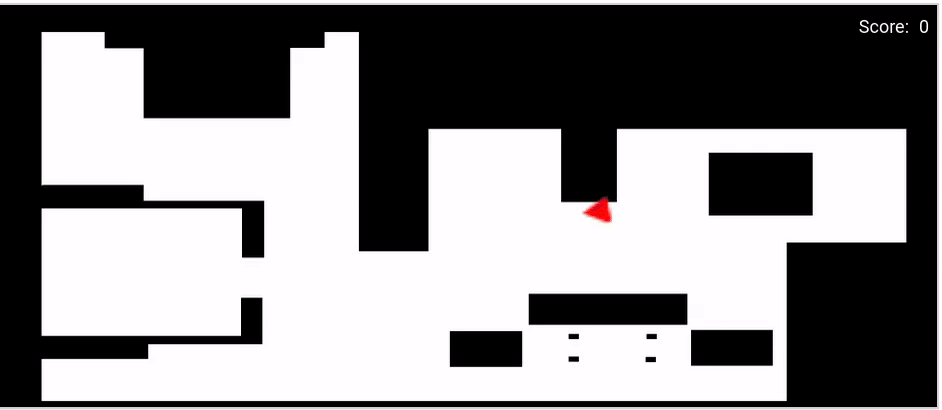
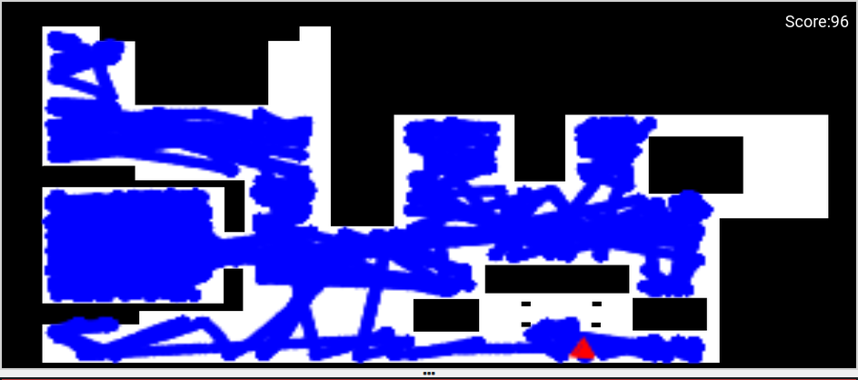
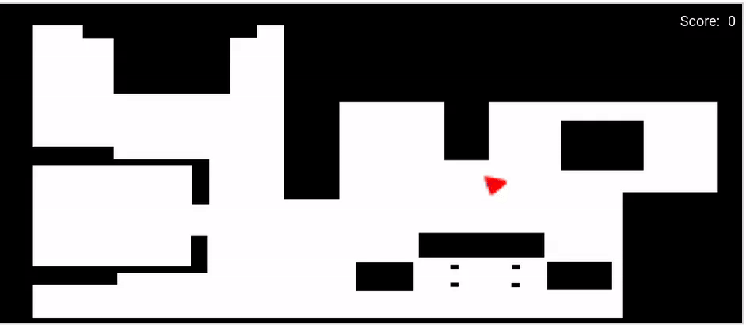

# Basic Vacuum Cleaner

For te first practice I have to program the behaviour of a basic vacuum cleaner.

Los requisitos del Programa:

* Maquina de estados
* Movimiento aleatorio
* Movimiento en espiral
* Uso del laser

Lo primero antes de iniciar a realizar el programa, siguiendo los requisitos pedido, debo pensar como quiero que se comporte, es decir, que estados tendrá, que algoritmo seguirá el movimiento aleatorio y como haré para leer las distancias y esquivar así los obstaculos del mapa.

## Primer paso en la implementación

Las conclusiones que saco son estas:

1.  Maquina de estados

    La maquina de estados que quiero implementar cuenta con un total de tres estados, siendo estos movimiento en forma de espiral, el movimiento hacia delante, y el giro que planeo convertir en un movimiento aleatorio.

2. Movimiento espiral

    Para realizar un movimiento spiral debo hayar las velocidades y el tiempo de giro por vuelta de forma matematica, así obtendré el movimiento pedido. La idea es que este sea el primer estado del programa y un posible estado recurrente

3. Detección de obstaculos

    Es impotante que detctemos obstaculos durante todo el programa para evitar cualquier tipo de choque sin importar el estado en el que nos encontremos. Para conseguir esto partimos del codigo que se nos entrega en la documentación de la practica:
    
    ```python
    laser_data = HAL.getLaserData()

    def parse_laser_data(laser_data):
        laser = []
        for i in range(180):
            dist = laser_data.values[i]
            angle = math.radians(i)
            laser += [(dist, angle)]
        return laser
    ```
4. Giro aleatorio

    Esta es una parte importante del programa, pues al crear un algoritmo que elija de forma aleatoria la dirección de giro y el tiempo de este podré obtener un comportamiento semi aleatorio, que es lo que se nos a pedido en la practica.

    Una primera idea de este algoritmo es que se elija un numero de una lista aleatoriamente, y según el valor de este se realice el giro hacia un lado u otro a demás de que el valor del numero dicte el tiempo de giro.

## Inicio de la implementacion

### Espiral
------
Dejo de lado trabajar con el laser mienras intento crear el movimiento en espiral. Para lograr este movimiento debo hacer los calculos necesarios para que las velocidades linear y angular sean las optimas.

Sabiendo que  ***v = w \* r*** siendo v la velocidad linear, w la velocidad angular y r el radio. Para obtener la espiral debo aumentar el radio tras cada vuelta y reducir la velocidad angular. El primer cálculo con el que pruebo es el siguiente:

```python
RADIO_INICIAL = 0.10
INCREMENTO_RADIO = 0.20
spiral_vel_v = 1.00
spiral_vel_w = spiral_vel_v / RADIO_INICIAL
```
Con esta operación, cada vez que se umente el radio disminuira la velocidad angular, haciendo un movimiento cada vez más amplio.

Dentro del bucle *while* tendgo entonces el siguiente código:

```python
HAL.setV(spiral_vel_v)
HAL.setW(spiral_vel_w)
RADIO_INICIAL += INCREMENTO_RADIO
spiral_vel_w = spiral_vel_v / RADIO_INICIAL
```
Por desgracia estas lineas de código no dan el resultado esperado a la hora de simular, pues el movimiento se vuelve linear al poco tiempo de iniciar el programa.


Despues de este problema llegué a la conclusión de que debia agregar un *Timer* que me permita realizar varias vueltas.

```python
tiempo_por_vuelta = 2 * math.pi * RADIO_INICIAL / spiral_vel_v
time.sleep(tiempo_por_vuelta)
``` 
El resultado obtenido ahora es más satisfactorio.


Tras una lectura de la documentacion de la practica pude leer que era más efectivo aumentar la velocidad linear que la angular. Tras hacer la prueba llego a la conclusión que efectivamente la velocidad parece más constante, pero no se genera una espiral igual de constante.


Investigando una forma de contar el tiempo sin usar un sleep que pueda cortar el tiempo de ejecución, logré encontrar que con la funcion ***time.time()*** puedo crear una función a la cual puedo añadir una condición que corte el bucle de espera.

```python
def my_sleep(segundos, condition):
tiempo_inicial = time.time()
while True:
    tiempo_actual = time.time()
    tiempo_transcurrido = tiempo_actual - tiempo_inicial
    if tiempo_transcurrido >= segundos:
        break 
    elif tiempo_transcurrido < segundos and condition:
        break
```
---
#### Laser

Una vez conseguido el movimiento en espiral debo empezar a trabajar con el laser para poder detectar obstaculos y asi poder detener el movimiento del robbot para iniciar el siguiente estado.

Para obtener la distancia leida por el laser uso el codigo dado en la documentación de la practica como ya dije anteriormente. Este codigo guarda en una tupla todas las distancias detectadas por el laser en un rango de 180º.

Como el rango base es muy grande para el movimiento que quiero lograr por ello edito el codigo para que el rango de detección sea menor y poder tener un movimiento más uniforme, pues los obstaculos que quiero detectar son aquellos que esten delante del robot.

> Funcion sin editar

```python
def parse_laser_data(laser_data):
    laser = []
    for i in range(180):
        dist = laser_data.values[i]
        angle = math.radians(i)
        laser += [(dist, angle)]
    return laser
```
> Función editada

```python
def parse_laser_data(laser_data):
    laser = []
    centro = 90  # Ángulo central del láser (180 grados divididos por 2)
    rango = 45   # Rango de ±45 grados o el angulo que desee, en caso de 
                 # elegir otro rango de distancia debo comprobar si necesito más calculos 
    for i in range(centro - rango, centro + rango + 1):
        if 0 <= i < 180:  # Me aseguro de que el índice esté en el rango válido
            dist = laser_data.values[i]
            angle = math.radians(i)
            laser += [(dist, angle)]
    return laser
```
---
#### Giro aleatorio

Para el giro he pensado en implementar un algoritmo que elija la direccion y tiempo de giro de forma aleatoria. Esta implementación ha pasado por dos versiones diferente, siendo la segunda más clara visualmente. 

El algoritmo es el siguiente: Se elige un numero entero de 0 a 9, en la primera versión eran los numero de 0 a 4 los que harian que el robot girase a un lado y de 5 a 9 el otro lado, pero para la segunda versión he optado por que impares signifiquen el giro a la izquierda y pares el giro a la derecha.

Una vez elegido el sentido de giro toca elegir el tiempo. Para no hacer que se deba elegir otro numero aleatorio he decidido que asignaré los tiempos al parejas de numeros, siedo por ejemplo si es 0 o 9, que sean 5 segundos; si es 1 o 8, que sean 4 segundos; y así sucesivamente

> Version 1.0
```python
  def random_turn():
    number = random.randint(0, 9)
    if number >= 0 and number <= 4:
        HAL.setW(ANGULAR_VEL_R)
        if number == 0:
            my_sleep_NO_condition(TURN_TIME_0_9)
        elif number == 1:
            my_sleep_NO_condition(TURN_TIME_1_8)
        elif number == 2:
            my_sleep_NO_condition(TURN_TIME_2_7)
        elif number == 3:
            my_sleep_NO_condition(TURN_TIME_3_6)
        elif number == 4:
            my_sleep_NO_condition(TURN_TIME_4_5)
            
    elif number >= 5 and number <= 9:
        HAL.setW(ANGULAR_VEL_L)
        if number == 5:
            my_sleep_NO_condition(TURN_TIME_4_5)
        elif number == 6:
            my_sleep_NO_condition(TURN_TIME_3_6)
        elif number == 7:
            my_sleep_NO_condition(TURN_TIME_2_7)
        elif number == 8:
            my_sleep_NO_condition(TURN_TIME_1_8)
        elif number == 9:
            my_sleep_NO_condition(TURN_TIME_0_9)
```

> Version 2.0
```python
    number = random.randint(0, 9)
    if number % 2 == 0:
        setW(0.2)  # Giro a la derecha
    else:
        setW(-0.2)  # Giro a la izquierda

    if number == 0 or number == 9:
        time_to_turn = 5
    elif number == 1 or number == 8:
        time_to_turn = 4
    elif number == 2 or number == 7:
        time_to_turn = 3
    elif number == 3 or number == 6:
        time_to_turn = 2
    else:
        time_to_turn = 1
```
Como podemos observar la segunda versión ocupa menor número de lineas de codigo.

Al final los giros quedan de la siguiente forma:

| NUMBER | DIRECTION | TIME |
|----------|----------|----------|
|     0    |   Right  |     4    |
|     1    |   Left   |     3    |
|     2    |   Right  |    2.5   |
|     3    |   Left   |     2    |
|     4    |   Right  |     1    |
|     5    |   Left   |     1    |
|     6    |   Right  |     2    |
|     7    |   Left   |    2.5   |
|     8    |   Right  |     3    |
|     9    |   Left   |     4    |

---
#### PRUEBAS

Una vez tenemos el laser que deteca obstaculos y la función de giro aleatorio, toca probar todo en conjunto, ya que hasta ahora solo he probado cada parte por separado. Es ahora cuando los fallos sintanticos y logicos empiezan a aparecer.

Una maquina de solo 2 estados siendo estos giro aleatorio y movimiento lineal hacia delante llega a funcionar de forma bastante correcta. Pero al momento de añadir el movimiento en espiral que el programa experimente errores logicos. 

El principal problema es la incapacidad de detectar objetos de forma correcta mientras se esta realizando la espiral. A este error se le une un fallo a la hora de pasar de un estado a otro.

Sin el estado que realiza el movimiento en espiral un ejemplo del resultado es el siguiente:



Como se puede ver si que resulta un movimiento aleatorio a la hora de elegir el lado de giro y el tiempo de este.

Este programa sin la realizacion de la espiral tras un largo perido de tiempo puede dar buenos resultados.



Hay que tener en cuenta que si en cualquier momento entra en la habitación del medio izquierda, el tiempo que el robot pasará ahí puede llegar a ser muy alto.

---
#### ARREGLO DE ERRORES

Una vez identififcado el error principal, el cual es como explique anteriormente que a la hora de realizar la espiral el programa no detecta obstaculos, es momento de arreglarlo. Para ello opté por empezar de cero la implementación de la espiral pero esta vez intentando buscar la solución más simple al problema (navaja de Ocham).

La conclusión que llego que pueda ser más simple es evitar calculos innecesarios y solamente aumentar la *velocidad lineal* tras cada iteración como se dice en la documentación.

```python
    HAL.setV(LINEAR_VEL)
    HAL.setW(ANGULAR_VEL)   
    LINEAR_VEL += 0.00125
```
El aumento debe de ser pequeño para que la espiral tenga un forma compacta sin dejar huecos tras cada vuelta.



---
#### PROGRAMA FINAL

Una vez arreglado el problema con la espiral y teniendo ya el resto de estados, es hora de juntar todo y empezar a ajustar los tiempos y velocidades para lograr un funcionamiento lo más optimo posible.

Debido al movimiento semi-aleatorio, cada vez que se inicia el programa si medimos en un mismo tiempo, siempre obtendremos un patrón diferente al anterior, obteniendo a veces un resultado mejor.

La mejor implementación hasta ahora era iniciar con el movimiento espiral y una vez detectado un obstaculo seguir un bucle de movimiento hacia delante seguido de un giro aleatorio cada vez que se detecte un obstaculo a la distancia indicada, pero es necesario añadir una forma de volver al movimiento espiral y que este sea eficiente.

Para realizar el giro anterior mente usaba una función con un bucle *while*, pero debido a que no es un buena practica de programación lo modifiqué de la siguiente manera, reduciendo el numero de funciones usadas:
```python
 if STATE == 1:
        
        laser_data = HAL.getLaserData()
        
        HAL.setV(0)  # Detener el movimiento lineal
    
        number = random.randint(0, 9)
        if number % 2 == 0:
            HAL.setW(ANGULAR_VEL_R)  # Giro a la derecha
        else:
            HAL.setW(ANGULAR_VEL_L)  # Giro a la izquierda
        global time_to_turn
        if number == 0 or number == 9:
            time_to_turn = 10
        elif number == 1 or number == 8:
            time_to_turn = 9
        elif number == 2 or number == 7:
            time_to_turn = 8
        elif number == 3 or number == 6:
            time_to_turn = 7
        else:
            time_to_turn = 6
        if (time.time() - Initial_time) >= time_to_turn:
            Initial_time = time.time()
            STATE = 2
```

De esta manera deberia evitarme el uso del bucle ya mencionado que cora la ejecución del programa. Por desgracia el funcionamiento final no es el esperado, pues el tiempo que tarda en cubrir la misma superficie es mayor que en la anterior versión del programa.

A continuación dos videos de la ejecución del programa con esta versión y la anterior.


https://github.com/iperal2021/blog/assets/113594702/e26f310b-3b4e-49d8-969b-b198cbb760e1

Como odemos ver en esta versión, la cual intenté desacerme de bucles innecesarios que pararan la ejecución. Los giros no son exactos por lo que tiene menor superficie recorrida.


https://github.com/iperal2021/blog/assets/113594702/0802bc5b-5b2c-4751-bdf4-f2ff83f94ed1

En esta versión se ha usado el bucle *while* pero los giros son más exactos y rapidos por lo que la superficie recorrida es mayor.
