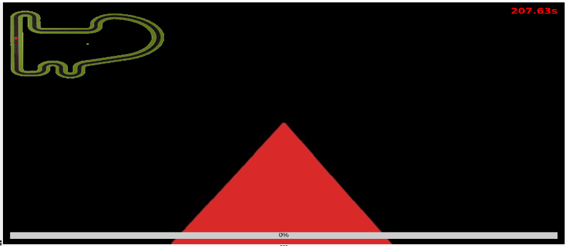
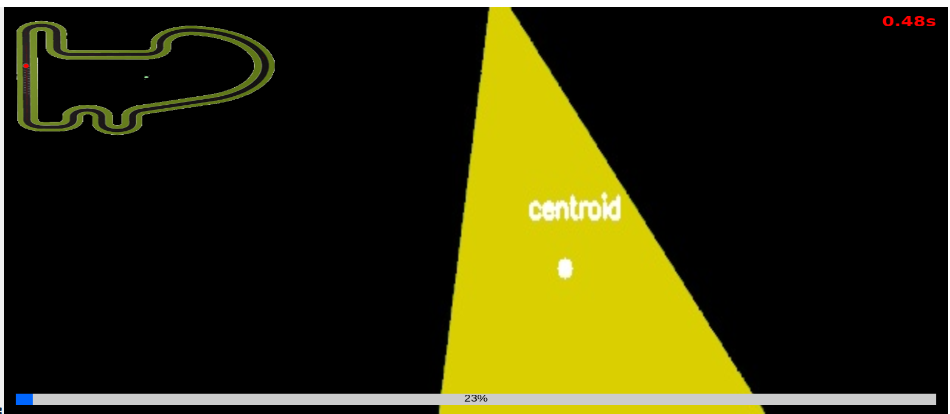
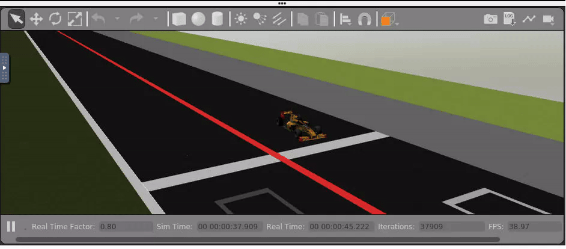
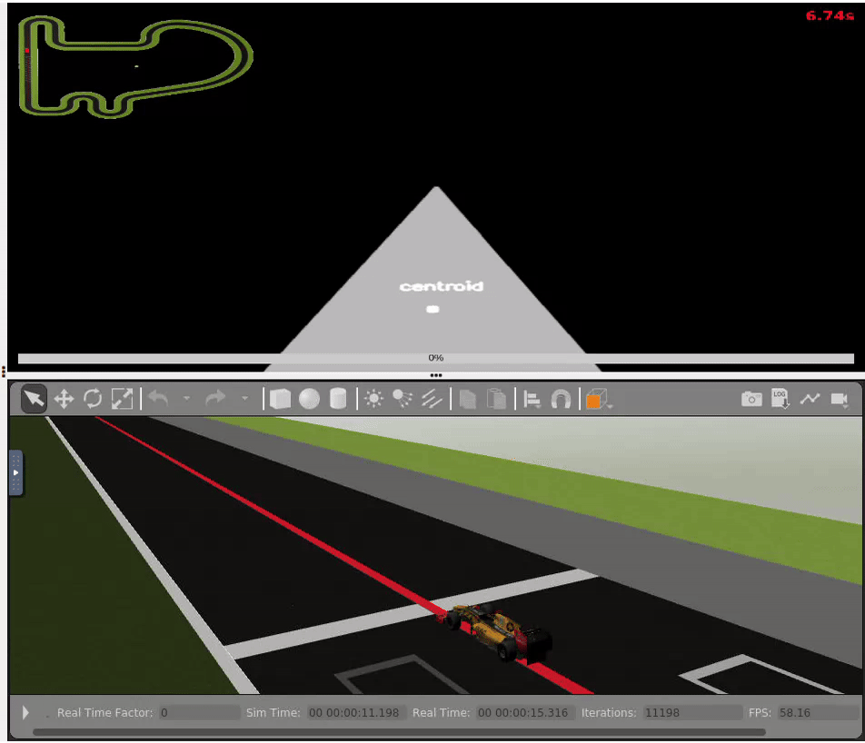

# Follow Line

For this second practice for mobile robotics, I need to implement the code for a seguidor de lineas, el cual debe de estar controlado por distintos controladores *PID* a demás de usar filtros de color para seguir la linea del circuito.

Empezamos con visión utilizando la biblioteca opencv 

## Planteamiento

Antes de comenzar a programar debo ponerme unos objetivos para que poco a poco el programa se desarrolle.

1. aislar la linea.
2. hallar el centroide
3. PID velocidad angular con error centroide - centro imagen
4. PID velocidad linear
5. Dividir la imagen en dos: dos centroides calcular errores linear y angular 
## PID

Un controlador PID (controlador proporcional, integral y derivativo) es un mecanismo de control que a través de un lazo de retroalimentación permite regular la velocidad, temperatura, presión y flujo entre otras variables de un proceso en general. El controlador PID calcula la diferencia entre nuestra variable real contra la variable deseada.

Esta practica en la version 1, solo usamos controladores PD ya que I no es necesario

empezaré implementando uno para la velocidad angular y mantener la linear constante. Más adelante se añadirá la velocidad linear.
## OpenCV
[OpenCV en español](https://omes-va.com/deteccion-de-colores/)

[OpenCV en inglés](https://stackoverflow.com/questions/10469235/opencv-apply-mask-to-a-color-image)

OpenCV es una biblioteca libre de visión artificial originalmente desarrollada por Intel.

Como la linea a seguir es d color rojo debo crear un filtro que solo detecte dicho color. Este es el codigo que consigue filtrar la imagen para solo mostrar dicho color.

```python
image = HAL.getImage()
    
    boundaries = [
	([17, 15, 100], [50, 56, 255])]

    for (lower, upper) in boundaries:
      	# create NumPy arrays from the boundaries
      	lower = np.array(lower, dtype = "uint8")
      	upper = np.array(upper, dtype = "uint8")
      	# find the colors within the specified boundaries and apply
      	# the mask
      	mask = cv2.inRange(image, lower, upper)
      	output = cv2.bitwise_and(image, image, mask = mask)
      	# show the images
      	GUI.showImage(output)
      	cv2.waitKey(0)
```



Lo siguiente a hallar una vez tenemos creada la mascara es el ***centroide*** de la figura para poder hacer los cálculos necesarios para seguir la linea.	


Para mejorar aun más la reactividad del programa podemos prescindir de la parte superior de la imagen pues en ella no se muestra nada relevante para la ejecución del programa. Por ello usando una vez más openCV la recortamos antes de trabajar con ella.
> corte = image_hsv[250:450, 0:image_hsv.shape[1]]



## Implementación

Tenemos el controlador P pero el codigo al ser lanzado nos devuelve tres resultados distintos: 

1. El proceso muere y el coche empieza a girar sin ningún control.
2. El proceso muere y el coche no se mueve en absoluto
3. EL proceso no muere y el coche se mueve exclusivamente en linea recta
   
> Escenario 1:



> Escenario 2:



> Escenario 3:


